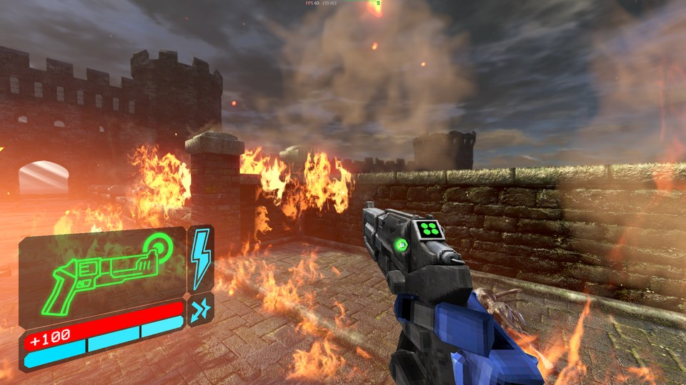
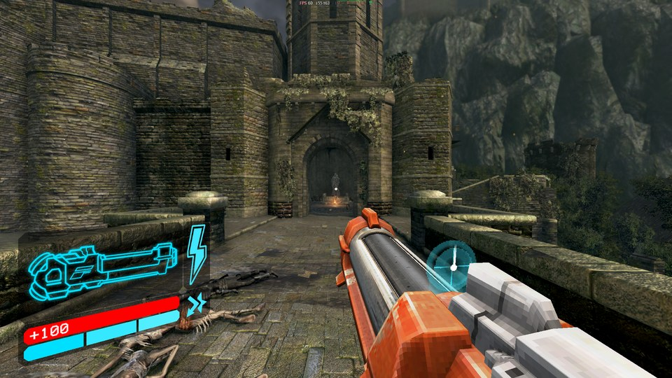
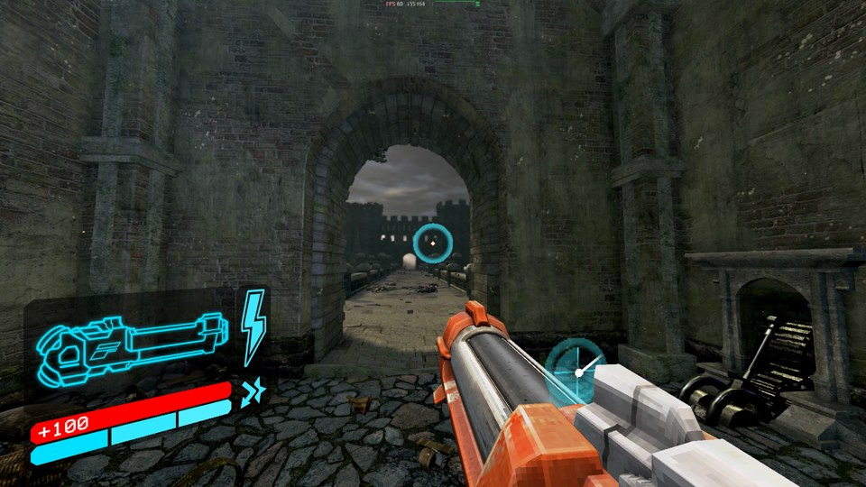
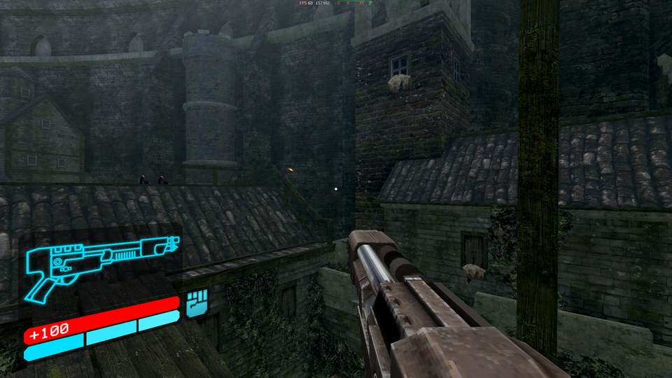
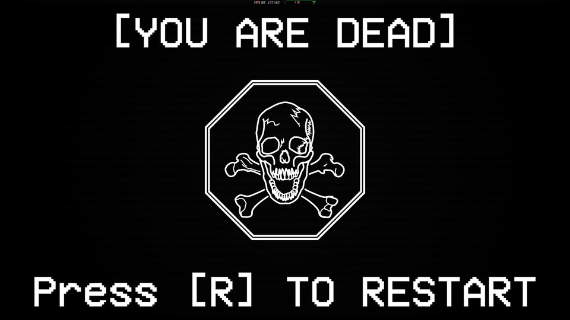
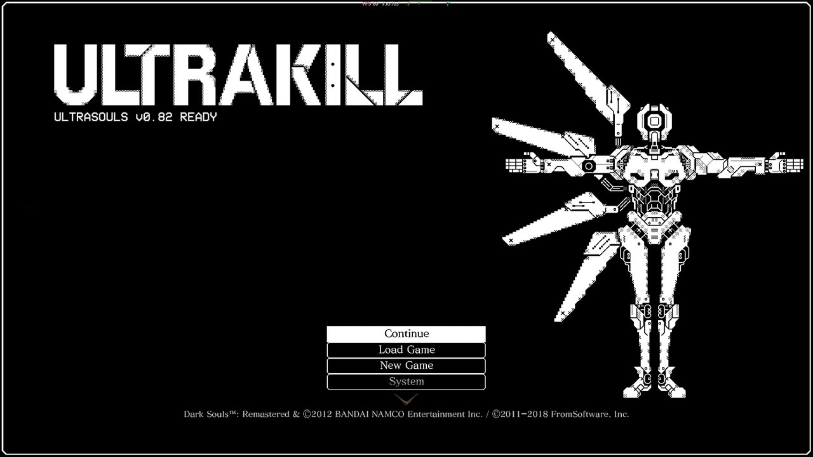

# ultrasouls

**ULTRAKILL's V1, loose in Lordran.** A work-in-progress mod that puts ULTRAKILL's movement, weapons, arms, HUD and style meter into Dark Souls Remastered, in first person.



> No game files are included, from either game. You need your own copy of **Dark Souls Remastered** and your own copy of **ULTRAKILL**: the models, animations, sounds and HUD are extracted from it on your machine. **Play offline** while the mod is installed.

## Screenshots

| | |
|---|---|
|  |  |
|  |  |



## What's in

Everything is matched against ULTRAKILL's own code and prefab data: speeds, timings, damage, sizes.

- **Movement**: jump, dash, slide, ground slam, wall jumps, slam storage, dash and slide jumps.
- **Revolvers**: Piercer, Marksman (coins and ricoshots) and Sharpshooter, each with its alternate "Slab" form.
- **Shotgun**: Core Eject and Pump Charge, with projectile boosts and core shots.
- **Sawblade Launcher**: Attractor (magnets) and Overheat.
- **Railcannon**: Electric and Malicious.
- **Rocket launcher**: Freezeframe and S.R.S. Cannon, with rocket riding.
- **Arms**: Feedbacker (parries, coin punches), Knuckleblaster (blast wave), Whiplash.
- **HUD**: ULTRAKILL's weapon panel, health and stamina, style meter and ranks, boss bars, the displays on the guns.
- **Feel**: healing from blood, hit stop, parry flash, camera tilt, explosions that throw you.
- **Death**: ULTRAKILL's death sequence and screen, and **R** to restart at the last bonfire with no loading.
- **Title screen**: Dark Souls' menu dressed as ULTRAKILL's.
- **V1's body** in third person.

Third person plays as normal Dark Souls; **F5** switches.

## Controls (first person)

| Key | Action |
|---|---|
| Mouse / WASD | Look / move |
| Left / right mouse | Fire / alt fire |
| 1 2 3 4 5 | Revolver, shotgun, sawblade launcher, railcannon, rocket launcher (again: next variation) |
| E / Q | Next / last variation |
| X | Revolver: standard or Slab |
| Space / Shift / Ctrl | Jump (wall jump by a wall) / dash / slide, or slam in the air |
| F / G | Feedbacker / Knuckleblaster |
| R | Whiplash; restart on the death screen |
| F5 | First person on/off |
| - / = | Mod volume |

The full key list, the settings in `ultrasouls.ini` and the test aids are in [docs/DETAILS.md](docs/DETAILS.md).

## Install

You need Python with `UnityPy`, and g++ (MSYS2 ucrt64). Set the two game folders at the top of `tools/patch_v1.py`, `tools/uk_bundles.py` and `tools/uk_assets.py`, then:

```bash
python tools/patch_v1.py --install
python tools/uk_hud_dump.py
python tools/uk_assets.py hud
python tools/uk_assets.py pack --install
python tools/uk_sounds.py pack --install
python tools/uk_models.py pack --install
python tools/ds_names.py --install
g++ -O2 -shared -static -o build/dinput8.dll dll/mod.cpp dll/hud.cpp dll/sound.cpp dll/dinput8.def -lpsapi -ld3d11 -ldxgi -lole32
```

Copy `build/dinput8.dll` next to `DarkSoulsRemastered.exe`. To uninstall, delete it and the `ultrasouls_*` files there, and put your own `GameParam.parambnd.dcx` back.

The addresses in the DLL are for one build of the Steam exe; [docs/DETAILS.md](docs/DETAILS.md) has its hash.

## Status

Work in progress, built and tested on one machine. The newest changes (v0.83, v0.84) have not been run in the game yet. Version by version notes, how each part works and what is still missing: [docs/DETAILS.md](docs/DETAILS.md).

Not affiliated with FromSoftware, Bandai Namco, Arsi "Hakita" Patala or New Blood Interactive.
